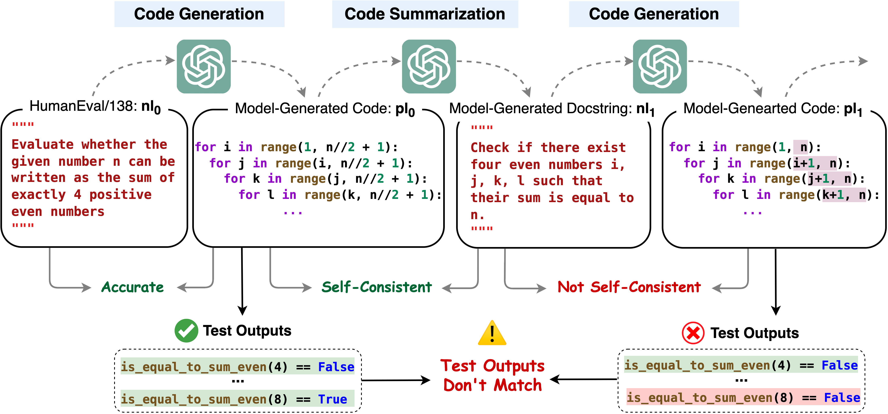

# IdentityChain

[](https://pypi.org/project/identitychain/) [](https://github.com/marcusm117/IdentityChain/actions/workflows/build.yml) [](https://github.com/marcusm117/IdentityChain/blob/main/LICENSE) [](https://github.com/marcusm117/IdentityChain/issues)

The IdentityChain Framework for Code Large Language Models (Code LLMs) Evaluation. Official implementation of the ICLR 2024 paper [Beyond Accuracy: Evaluating Self-Consistency of Code Large Language Models with IdentityChain](https://arxiv.org/abs/2310.14053).

The IdentityChain Framework evaluates the NL-to-PL (Code Generation) Accuracy, PL-to-NL (Code Summurization) Accuracy, and the Self-Consistency across the two tasks. It also provides a fine-grained analysis of the model's performance so that you can pinpoint the exact step and problem where the model makes a self-inconsistency violation.



## Installation

Create and Activate a Conda Environment.

   ``` bash
   conda create -n idchain python=3.10
   conda activate idchain
   ```

Install from PyPI with all Dependencies.

   ``` bash
   pip3 install identitychain
   pip3 install -r requirements.txt
   ```

Install from Source with all Dependencies.

   ``` bash
   git clone https://github.com/marcusm117/IdentityChain.git
   cd IdentityChain
   make develop
   ```

## Usage

Before the self-consistency evaluation, you need to make sure that one of the followings is satisfied:

1. Your model is an Instruction-tuned Code LLM, and it's trained on both NL-to-PL and PL-to-NL tasks.
2. Your model is a Foundation Code LLM, and it's trained on both completion and fill-in-the-middle tasks.

To evaluate your model using IdentityChain, you need to prepare the followings:

1. An evaluation dataset from one of the followings (or one of your own in the same format):
   - [EvalPlus-Mini-v0.1.6_reformatted.jsonl](./data/EvalPlus-Mini-v0.1.6_reformatted.jsonl.gz)
   - [EvalPlus-Mini-v0.1.10_reformatted.jsonl](./data/EvalPlus-Mini-v0.1.10_reformatted.jsonl.gz)
   - [MBPP-S_test_reformatted.jsonl](./data/MBPP-S_test_reformatted.jsonl.gz)
2. An NL-to-PL prompt for your model
3. A PL-to-NL prompt for your model
4. An NL-to-PL generation function for your model
5. A PL-to-NL generation function for your model

See [run_identity_chain_openai.py](./examples/run_identity_chain_openai.py) for an example of how to use IdentityChain to evaluate OpenAI models.

See [run_identity_chain_google.py](./examples/run_identity_chain_google.py) for an example of how to use IdentityChain to evaluate Google models.

See [run_identity_chain_huggingface.py](./examples/run_identity_chain_huggingface.py) for an example of how to use IdentityChain to evaluate HuggingFace open-source models. This example script already includes the following models:

1. CodeLlama-Instruct-hf (7B, 13B, 34B, 70B)
2. CodeLlama-hf (7B, 13B, 34B, 70B)
3. StarChat-Beta
4. StarCoder
5. StarCoderPlus
6. StarCoderBase (1B, 3B, 7B, 15B)
7. DeepSeekCoder-Instruct (1.3B, 6.7B, 33B, 7B-v1.5)
8. DeepSeekCoder (1.3B, 6.7B, 33B, 7B-v1.5)

## Example

Use [run_identity_chain.sh](./examples/run_identity_chain.sh) to execute scripts [run_identity_chain_openai.py](./examples/run_identity_chain_openai.py) or [run_identity_chain_huggingface.py](./examples/run_identity_chain_huggingface.py), which conducts several IdentityChain evaluation in a batch. Make sure that you modify the followings before running the script:

1. `export CUDA_VISIBLE_DEVICES=0` to specify the local GPU device you want to use
2. `export HF_HOME=YOUR_OWN_PATH/huggingface` to specify your own huggingface home path, where the model checkpoints will be cached
3. `export IDENTITY_CHAIN_HOME=YOUR_OWN_PATH/IdentityChain` to your own IdentityChain home path
4. other parameters in the script for your own needs

Then run the script:

``` bash
cd examples
bash run_identity_chain.sh
```

This script will create a temporary folder `tmp` under your IdentityChain home path, and store the results of IdentityChain evaluation in this folder, which will be a `jsonl` file. For example, `tmp/starcoderbase-1b/IDChain_starcoderbase-1b_tmp0.0g_len5_pb_all_m_v1_EvalPlus-Mini-v0.1.6_reformatted.jsonl`.

Use [analyze_results.py](./scripts/analyze_results.py) to analyze the results of IdentityChain evaluation. It will geneartes an `xlsx` file, which contains the following information:

1. The SC (Self-Consistency) and SSC (Strong Self-Consistency) scores of the model at each self-iteration step. Note that SSC_0 is just Pass@1
2. The aggregated TOM score (also BLEU and CodeBLEU) information at each step for the following 4 types of resulsts: Pass-Pass, Pass-Fail, Fail-Fail, Fail-Pass
3. The TOM score (also BLEU and CodeBLEU) trajectory at each self-iteration step for each sample in the eavluation set.
4. The raw test case outputs at each self-iteration step

``` bash
cd ../scripts
python analyze_results.py --input_path ../tmp/starcoderbase-1b/IDChain_starcoderbase-1b_tmp0.0g_len5_pb_all_m_v1_EvalPlus-Mini-v0.1.6_reformatted.jsonl --chain_length 5
```

The analyzed results will give you a sense of the model's overall performance, and the TOM score trajectory will help you pinpoint the exact step where the model makes a mistake.

Use [browse_results.py](./scripts/browse_results.py) to browse the results of IdentityChain evaluation. You can use this script to manually examine and study the mistakes made by the model for specific samples.

``` bash
cd ../scripts
python browse_results.py --input_path ../tmp/starcoderbase-1b/IDChain_starcoderbase-1b_tmp0.0g_len5_pb_all_m_v1_EvalPlus-Mini-v0.1.6_reformatted.jsonl --chain_length 5 --start 0
```

## Linting & Testing

We use a `Makefile` as a command registry:

- `make format`: autoformat  this library with `black`
- `make lint`: perform static analysis of this library with `black` and `flake8`
- `make annotate`: run type checking using `mypy`
- `make test`: run automated tests
- `make check`: check assets for packaging

Make sure that `make lint`, `make test`, and `make check` all pass locally before submitting a Pull Request.
